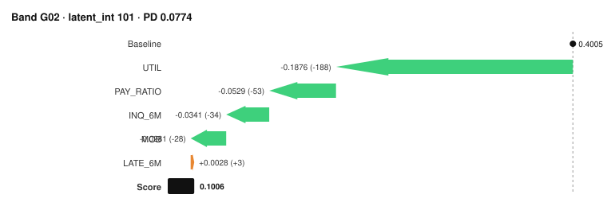

# CompileML

[](https://github.com/orgoca/CompileML/actions/workflows/ci.yml)
[](https://pypi.org/project/compileml/)
[](https://pypi.org/project/compileml/)
[](LICENSE)

**Compile tree-ensemble models into deterministic, auditable decision artifacts.**

<p align="center">
  
</p>
<p align="center"><sub>One decision, drawn from its own integers — the bars sum to the score because the
reconciliation identity says they must. Rendered by <code>compileml.viz.waterfall_svg</code>
from the repo's committed reference artifact, with zero dependencies.</sub></p>

CompileML separates *training* a credit-risk model from *running* one. Train with
whatever you like — XGBoost, LightGBM, scikit-learn, or a neural network distilled
into a whitebox — then compile the decision into a single hashed JSON artifact
that carries the score, the calibrated probability, the risk bands, and the
adverse-action reason codes. The artifact runs anywhere: a pure-standard-library
Python runtime, a generated SQL query, or a generated COBOL program — and it
produces **the same integers everywhere**.

```python
from compileml.compile import train_whitebox
from compileml.bands import monotone_quantile_bands
from compileml.artifact import build_artifact, save_artifact

# 1. Any strong model is the teacher; distill it into a depth-2 whitebox.
whitebox, fidelity = train_whitebox(X_train, teacher.predict_proba(X_train)[:, 1])
latent = whitebox.predict(X_train).clip(0, 1)

# 2. Bands with empirical bad-rate semantics, then compile everything into one file.
bands = monotone_quantile_bands(latent, y_train, n_bands=10)
artifact = build_artifact(
    whitebox, feature_names, baseline=medians, band_edges=bands,
    calibration_latent=latent, calibration_y=y_train,
    reasons=REASON_DICTIONARY,          # your customer-facing reason texts
)
save_artifact(artifact, "decision.json")
```

```python
# 3. Production: the runtime imports nothing outside the standard library.
from compileml.runtime import load_artifact, decide

artifact = load_artifact("decision.json")        # SHA-256 verified, refuses tampering
decision = decide(artifact, applicant_row)
# {
#   "band": "G07", "pd": 0.1284, "latent_int": 146,
#   "reasons_negative": [{"code": "HIGH_UTILIZATION", "message": "…", "impact_int": 56}],
#   "reasons_positive": [...],
#   "artifact_hash": "84372c36…"
# }
```

```bash
# Or skip Python entirely.
compileml export decision.json --target sql   --out scorer.sql
compileml export decision.json --target cobol --out scorer.cob
```

## Why

Three things keep strong models out of regulated production:

1. **Scores that drift.** Floating-point accumulation varies across hardware,
   compilers, and library versions. A credit score should be a fact, not a
   distribution over environments.
2. **Explanations that don't reconcile.** Post-hoc explainers approximate; when
   the numbers don't add up to the decision, an adverse-action notice is a
   guess with a signature.
3. **Deployment stacks that banks don't have.** The decision often needs to run
   on rails that predate Python — core banking systems, SQL warehouses,
   mainframes.

CompileML's answer is to change the deployed unit. At compile time, every leaf
of the model is quantized **once** to an integer. From then on, scoring is
integer addition, banding is integer comparison, calibration is integer table
lookup, and attribution is integer differences. The only floating-point
operation left anywhere is the split comparison `x <= threshold`, which is
exact under IEEE 754. There is nothing left to drift.

## The guarantees — and how each one is enforced

| Guarantee | Mechanism | Enforced by |
|---|---|---|
| Same input → same integer outputs, on any platform, in any language | integer-only arithmetic after compile-time quantization | SQL parity test executes the generated query in SQLite and asserts `==` per row; COBOL parity compiled and run in CI |
| Explanations sum exactly to the decision | attribution in half-micro integer units; `2·(score − baseline) == Σ contributions + residual` is an arithmetic identity | reconciliation check re-adds it on every validation run |
| Exact attribution (zero residual) at whitebox depth ≤ 2 | pairwise functional decomposition is complete for depth-2 trees | recorded in the artifact; builds warn beyond depth 2; validation fails artifacts that claim exactness and miss it |
| One deployed truth | score + calibration + bands + reasons in a single JSON with a SHA-256 hash | loaders verify the hash by default and refuse tampered artifacts |
| Reproducible builds | no timestamps or randomness in hashed content | benchmark suite rebuilds and asserts hash equality |
| Zero-churn recalibration | PD table refits while model and band edges stay byte-identical; new artifact records its predecessor's hash | test proves no row changes band across recalibration |

## Measured performance

From `benchmarks/run_benchmarks.py` — deterministic synthetic credit data
(40k rows, 23 features), consumer laptop, pure-Python runtime. Run it yourself;
every number in this table is regenerated by that script.

| Metric | Value |
|---|---|
| Teacher Gini (300-tree GBM) | 0.667 |
| **Compiled integer artifact Gini** | **0.653 (97.9% retention)** |
| Band-ordinal Gini (10 bands) | 0.647 (97.0% retention) |
| Spearman, teacher vs artifact | 0.977 |
| Score + band + calibrated PD | **0.03 ms median** (0.04 ms p95) |
| Full exact explanation (23 features) | 8.4 ms median |
| Band assignment alone | 0.2 µs |
| Artifact size | 97 KB |
| Rebuild hash identical | ✔ |

Honest notes: the score path is sub-millisecond; the *full explanation* path is
not, because it computes an exact pairwise decomposition — `1 + p + p(p−1)/2`
ensemble traversals at `p` features. It is exact, not sampled, and it is priced
accordingly. Score first, explain the rows you need to explain.

## What CompileML is not

- **Not a modeling constraint.** The additive artifact is a deployment
  interface. The teacher can be anything; depth-2 distillation preserved 97.9%
  of Gini in the benchmark above, and the retention is measured, not assumed.
- **Not a claim about your data pipeline.** Determinism means: identical input
  bytes + identical artifact ⇒ identical outputs. Producing identical input
  bytes across systems is the caller's contract.
- **Not a compliance certification.** It is infrastructure designed so that
  validation teams can verify things instead of trusting them.

## Reason codes are your content

CompileML computes *which* features drove a decision and by *how much* — but a
customer-facing reason is institutional language, not math. You supply a
dictionary; coverage is measured, warned about at compile time, recorded in the
artifact, and optionally hard-gated at validation:

```python
REASON_DICTIONARY = {
    "BILLS_PAID_LATE": {
        "code": "LATE_PAYMENTS",
        "negative": "Recent payments were made after their due date.",
        "positive": "Consistent on-time payment history.",
    },
    # …one entry per feature; `suppress: True` hides policy-masked features
}
```

Features without an entry still work — they fall back to generic messages —
but generic messages are not adverse-action grade, and the tooling will keep
telling you so.

## Seeing decisions

`compileml[viz]` adds payload-driven plots — they draw the integers `decide()`
emitted, never a recomputation, so a chart can never disagree with the deployed
decision:

```python
from compileml.viz import waterfall, decision_drivers, band_drivers, band_ladder

waterfall(decide(artifact, row, include_contributions=True))   # one decision, audited
decision_drivers(sample_decisions, y=y_sample)                 # population drivers
band_drivers(sample_decisions, y=y_sample)                     # drivers per band
band_ladder(score_decisions, y_sample)                         # bad-rate monotonicity
```

`waterfall_svg()` renders the same waterfall with the standard library alone —
the image above is its output.

## The validation framework

`compileml validate artifact.json --csv holdout.csv --y-col DEFAULT` runs eight
checks — integrity, reconciliation, fidelity, band coverage, bad-rate
monotonicity, ladder churn, explanation stability, reason coverage — **all
against the artifact through the same runtime production uses**. There is no
notebook shadow implementation to drift out of sync. Exit code is 0/1, so CI
can gate deployments on it.

## Install

```bash
pip install compileml            # compile side: numpy + scikit-learn
pip install compileml[xgboost]   # optional teachers
pip install compileml[lightgbm]
```

The runtime subpackage (`compileml.runtime`) imports only the Python standard
library — enforced by a unit test that parses every runtime module's imports.
Vendoring `src/compileml/runtime/` alone into a constrained environment works.

## Documentation

- [Quickstart](docs/quickstart.md)
- [Artifact specification](docs/ARTIFACT_SPEC.md) — the normative contract
- [Reason codes how-to](docs/howto/reason-codes.md)
- [Zero-churn recalibration](docs/howto/recalibrate.md)
- [Deploying: runtime, SQL, COBOL](docs/howto/deploy.md)
- [Validation framework](docs/howto/validate.md)
- Executable examples in [`examples/`](examples/)

## Roadmap

- Leaf-time exact attribution (removes the O(p²) explanation cost)
- Java and C exporters; COBOL calibration section
- Optional numpy batch scoring accelerator
- Fairness audit module

## License

Apache-2.0. Copyright 2026 Carlos Ortiz.
